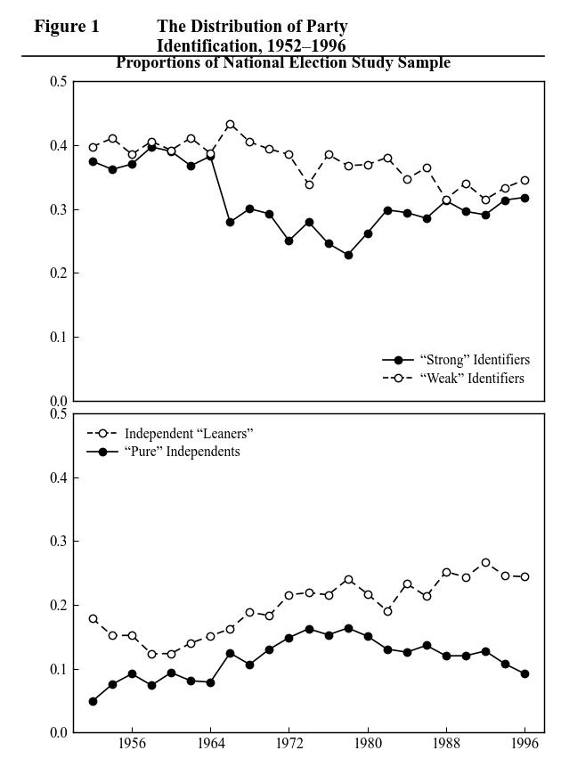

# LLM-Assisted Paper Replication: Bartels (2000)

## Project Overview

This project uses Claude Code as a local AI agent to replicate all statistical tables and figures from **Bartels, Larry M. (2000). "Partisanship and Voting Behavior, 1952–1996." _American Journal of Political Science_, 44(1), 35–50.** 

The workflow has three high-level steps:

1. **Data Discovery & Acquisition** — AI reads the paper, identifies required data, and obtains or requests it
2. **Data Validation** — AI runs a few exploratory replication attempts to verify the data is sufficient
3. **Full Replication** — Iterative replication with scoring, discrepancy analysis, and refinement

**No API keys are needed.** Claude Code itself is the AI agent — it reads files directly, generates code, and executes it locally.

---

## Required Input Files

Place this file in the same directory as this CLAUDE.md:

| File | Description |
|------|-------------|
| `Bartels_2000.pdf` | The paper to replicate |
| `Figure1.png` through `Figure6.png` (optional) | Screenshots of original figures from the paper for visual comparison. Place them in the project root. The AI agent will use these for side-by-side comparison in the final report. |

The AI agent determines what data and documentation are needed and either downloads them or tells you how to get them.

For figure replication, if original figure screenshots (e.g., `Figure1.png`) are present in the project root, the AI will use them for side-by-side visual comparison in the final report. If not provided, the AI may ask you to supply them.

---

## How to Use

### Setup (do this once before your first run)

1. **Obtain the paper.** Save the research paper as a PDF in this directory.
2. **Set up the Python environment.** Create a virtual environment and install the base packages:
   ```bash
   python3 -m venv .venv
   .venv/bin/pip install pandas numpy statsmodels scipy matplotlib
   ```
   The AI agent may install additional packages as needed during the workflow.
3. **Install Claude Code.** Follow the instructions at https://docs.anthropic.com/en/docs/claude-code to install Claude Code. An Anthropic API key or a Claude subscription is required.

### Running a replication

1. Start Claude Code in this directory
2. Tell it what to replicate:
   - `"Replicate Table 1"` — a single target
   - `"Replicate all"` — all targets, sequential mode (one at a time)
   - `"Replicate all in parallel"` — all targets, parallel mode (concurrent subagents)
3. Claude Code follows the 3-step workflow below autonomously
4. All artifacts are saved to target-specific output directories (e.g., `output_table1/`)

To resume an interrupted session: say `"Resume replication"` — Claude Code reads `state.json` files from the output directories and continues from where it left off.

---

## Step 1: Data Discovery & Acquisition

The AI agent reads the paper and autonomously determines what data and documentation are needed, then acquires them.

### Phase 1A: Paper Analysis

0. **Record the workflow start time** (run `date "+%Y-%m-%d %H:%M:%S"`) and save it to `workflow_start_time.txt` in the project root. This marks the beginning of the entire replication workflow and is used for wall-clock elapsed time calculation.

1. **Read the paper thoroughly.** Identify:
   - What dataset(s) the paper uses (name, year, source organization)
   - What variables are needed (dependent, independent, controls, instruments)
   - What supplementary documentation is needed (codebooks, variable descriptions, questionnaire text)
   - Sample restrictions (time period, subpopulation, geographic scope)
   - Any additional data sources (e.g., Census data merged in, external indices)

2. **Save findings** to `data_requirements.txt` in the project root. This file must include:
   - Dataset name and year (e.g., "General Social Survey, 1993")
   - Source organization (e.g., "NORC at the University of Chicago")
   - A list of all required variables with brief descriptions
   - Any supplementary documentation needed
   - Sample restrictions that affect which data to obtain

### Phase 1B: Automated Data Acquisition

Attempt to download or construct the required data programmatically. Try these strategies in order:

1. **R packages** — Many survey datasets have dedicated R packages (e.g., `gssr` for GSS, `anes` for ANES, `tidycensus` for Census data). Write and execute an R script to download and extract the needed variables. Example:
   ```r
   # Install and use dataset-specific packages
   install.packages('gssr', repos = c('https://kjhealy.r-universe.dev', 'https://cloud.r-project.org'))
   library(gssr)
   data <- gss_get_yr(1993)
   ```

2. **Python packages** — Some datasets have Python APIs (e.g., `census`, `fredapi`, `wbdata`). Write and execute a Python script.

3. **Direct downloads** — If the data is available from a public URL (e.g., ICPSR, government data portals), download it using `curl` or `wget`.

4. **Web scraping** — As a last resort for publicly available data tables, scrape them programmatically.

For each strategy, also attempt to obtain documentation (codebooks, variable descriptions). Many R data packages include built-in documentation (e.g., `gssrdoc` provides GSS variable labels).

**After successful download:**
- Save the dataset as a CSV file in the project root.
- Save documentation as a text file.
- Record in `data_requirements.txt` how the data was obtained (package name, script used, etc.)

### Phase 1C: Manual Acquisition Instructions (if automated download fails)

If automated download is not possible for some or all of the required data:

1. **Create `data_acquisition_instructions.md`** with clear, step-by-step instructions for the human:
   - Where to go (specific URLs for data repositories)
   - What to search for (dataset name, study number)
   - What file(s) to download (format preferences: CSV > Stata > SPSS > SAS)
   - What variables to include (if the repository allows variable selection)
   - Where to save the files and what to name them
   - Any account registration needed (e.g., ICPSR requires free registration)
   - How to obtain codebooks or documentation

2. **Notify the human** and pause. Display a clear message:
   ```
   I need you to download the following data manually:
   - [Dataset name] from [Source]
   See data_acquisition_instructions.md for detailed instructions.
   Please let me know when the files are ready.
   ```

3. **When the human confirms the data is available**, verify the files exist and continue to Step 2.

### Phase 1D: Data Inspection

Once the data is available (whether downloaded automatically or provided by the human):

1. **Verify the data file** — Read the first few rows, check column names, row count, data types
2. **Verify the documentation** — Confirm the codebook covers the required variables
3. **Check for obvious issues** — Missing columns, unexpected formats, encoding problems
4. **Save a brief inspection report** to `data_inspection.txt` summarizing what was found

### Phase 1E: Target Extraction

With the paper already read and data confirmed available, extract the detailed ground-truth information for every replication target (tables and figures).

1. For each target identified in the paper, extract **everything needed to replicate it from scratch**, including:
   - Table/figure structure (models, columns, rows, panels)
   - All variables used (dependent and independent), and how they are constructed
   - Dependent variable definition (what it counts, what ratings qualify, sample restrictions)
   - Independent variable definitions (how each is coded, any composite scales)
   - Sample restrictions (who is included/excluded and why)
   - Statistical methods (OLS, logistic regression, standardized coefficients, etc.)
   - Exact "true" results: coefficients, standard errors, sample sizes (N), log likelihood, pseudo-R², constants
   - For figures: the construction method (e.g., what regressions to run, what values to extract, how to sort, what to plot on each axis)
   - Any footnotes or text in the paper that clarify variable construction, sample selection, or methodology
2. Create output directories: `mkdir -p {output_dir}` for each target (use `output_table1/`, `output_table2/`, `output_table3/`, or `output_figure1/` as appropriate)
3. Save the extracted information to `{output_dir}/table_summary.txt` (or `figure_summary.txt` for figures)

**Important:** Extract numerical values as precisely as possible. These are the "ground truth" that generated results will be compared against.

**Verification step:** After transcribing all values, re-read the relevant paper page(s) to double-check every number. Transcription errors in `table_summary.txt` cause false scoring penalties and wasted iterations.

**Completeness check:** The `table_summary.txt` (or `figure_summary.txt`) must contain enough detail that the code generation phase can produce correct code without re-reading the paper. Include all variable definitions, coding rules, sample restrictions, and expected results.

### Phase 1F: Variable Mapping

With the codebook/documentation available from Phase 1D and the target details from Phase 1E, map every variable to the dataset.

1. Read the dataset documentation/codebook in its entirety
2. For each target, map every variable mentioned in the paper to its corresponding column name in the dataset
3. Document for each variable:
   - Paper name and dataset field name
   - Value labels and coding (from the codebook)
   - How to construct/recode the variable to match the paper's definition (e.g., dummy variables, scale construction, composite indices)
   - Which values indicate missing data (e.g., 0, 8, 9, 98, 99, or specific codes per variable)
   - Sample restrictions: which respondents to include/exclude based on this variable
4. For composite variables (scales, indices, counts), document the full construction recipe: which items, how to score each item, how to combine, whether to allow partial data
5. Cross-check: verify that every variable in `table_summary.txt`/`figure_summary.txt` has a corresponding dataset mapping
6. Save to `{output_dir}/instruction_summary.txt` for each target

---

## Step 2: Data Validation (Exploratory Replication)

Before committing to the full iterative replication, run a lightweight validation to confirm the data and documentation are sufficient.

### Phase 2A: Exploratory Attempts

Run up to **3 exploratory attempts** of the replication. Each attempt follows the same code-generation-and-execution cycle as Step 3 (Phases 1–4), but with relaxed expectations. The `table_summary.txt`/`figure_summary.txt` and `instruction_summary.txt` created in Step 1 (Phases 1E–1F) are already available to guide code generation.

1. Generate and run analysis code (using `table_summary.txt` and `instruction_summary.txt`)
2. Score the results against the paper
3. Write a discrepancy report

Save all artifacts to the target's output directory with the standard naming convention (see Artifact Management).

### Phase 2B: Data Sufficiency Assessment

After 3 exploratory attempts (or fewer if a score >= 70 is reached), evaluate:

1. **Are the required variables present?** Check if all variables mentioned in the paper can be found (directly or via construction) in the dataset.
2. **Is the sample size reasonable?** Compare your N to the paper's N. A difference > 20% suggests missing data or wrong data subset.
3. **Are the results in the right ballpark?** Coefficients don't need to match exactly yet, but signs should mostly agree and orders of magnitude should be correct.
4. **Are there unexplained coding issues?** Variables with unexpected value ranges, unlabeled categories, or systematic missing data patterns.

Save the assessment to `{output_dir}/data_validation_report.txt`.

### Phase 2C: Decision Point

Based on the assessment:

- **Data is sufficient** (variables present, N is reasonable, results are directionally correct):
  - Proceed to Step 3 (Full Replication)
  - The exploratory attempts carry over — their attempt numbers, scores, and artifacts continue into Step 3

- **Additional data or documentation is needed:**
  1. Create `additional_data_request.md` explaining:
     - What is missing (specific variables, documentation, or supplementary data)
     - Why it is needed (e.g., "The paper uses occupational prestige scores but the current dataset lacks the PRESTG80 variable")
     - How to obtain it (specific download instructions)
  2. Notify the human and return to Step 1
  3. When the human provides the additional data, re-run Step 2 from the beginning

---

## Step 3: Full Replication

This is the core iterative replication process. It picks up from where Step 2 left off (exploratory attempts carry over).

### ⚠️ CRITICAL RULES — READ BEFORE STARTING ⚠️

> **THE MOST IMPORTANT RULE IN THIS ENTIRE DOCUMENT:**
> You MUST keep iterating until score >= 95 or 20 attempts are exhausted.
> Do NOT stop at 80. Do NOT stop at 85. Do NOT stop at 92.
> Do NOT summarize results and declare success before reaching 95.
> Do NOT move on to the next target before reaching 95 (or 20 attempts).
> If your score is below 95 and you have attempts remaining, GO BACK TO PHASE 1 AND TRY AGAIN.

1. **NEVER stop iterating on a target until score >= 95 or 20 attempts are exhausted.** A score of 80, 85, or 92 is NOT sufficient. Keep going. Do not declare victory early. Do not "wrap up" early. Do not produce the final report early. The iteration loop is: Phase 1 → Phase 2 → Phase 3 → Phase 4 → Phase 5 → back to Phase 1. This loop repeats until the exit condition is met. There are only two valid exit conditions: (a) score >= 95, or (b) 20 attempts exhausted.
2. **ALWAYS write a discrepancy report after every attempt** (Phase 4). The discrepancy report drives the next iteration; skipping it means the next attempt will be uninformed.
3. **ALWAYS save all artifacts for every attempt** — results file, discrepancy report, run_log entry, and state.json update. No exceptions.
4. **ALWAYS update best_generated_analysis.py** when a new best score is achieved (see Best Result Tracking under Artifact Management for the full procedure).

### Phase 1: Code Generation

The `table_summary.txt`/`figure_summary.txt` and `instruction_summary.txt` for this target were created in Step 1 (Phases 1E–1F). If they are missing, return to Step 1 to create them before proceeding.

1. **Record the start time** of this attempt (run `date "+%Y-%m-%d %H:%M:%S"`)
2. **On the first attempt only:** create `{output_dir}/state.json` (see Canonical state.json Schema under Time Tracking for the format) and `{output_dir}/run_log.csv` with its header row. If these files already exist from a prior session or from Step 2, append to `run_log.csv` (do not overwrite) and resume from the attempt number recorded in `state.json`.
3. Read `{output_dir}/table_summary.txt` (or `figure_summary.txt`) and `{output_dir}/instruction_summary.txt` to understand the target and variable mappings
4. Read the first 5 rows of the dataset CSV to understand column names and data types
5. Generate a self-contained Python script following the Code Generation Contract below
6. For the first attempt: save as `{output_dir}/generated_analysis.py`
7. For retry attempts: save as `{output_dir}/generated_analysis_retry_{N}.py`

When retrying, provide this context to inform the new code:
- The best attempt so far: read `{output_dir}/best_generated_analysis.py` and its discrepancy report
- The most recent attempt: read the previous attempt's code and its error/discrepancy report
- The best score achieved so far

### Phase 2: Execution

1. Run the generated script: `.venv/bin/python {output_dir}/generated_analysis.py` (or the retry file)
2. If the script produces a **runtime error**:
   - Save the full traceback to `{output_dir}/runtime_error_attempt_{N}.txt`
   - Set the score to 0 and proceed to Phase 4 (the discrepancy report must document the error and how to fix it)
3. If the script runs **successfully**:
   - Read the output
   - Save results to `{output_dir}/generated_results_attempt_{N}.txt`
   - For figures: the script saves an image file; copy it to `{output_dir}/generated_results_attempt_{N}.jpg`

### Phase 3: Scoring (0-100)

Compare the generated results against the true results from `{output_dir}/table_summary.txt` (or `figure_summary.txt`). Assign a score from 0 to 100 using the appropriate rubric below.

**Scoring rubric for regression tables:**

| Criterion | Points | How to assess |
|-----------|--------|---------------|
| Coefficient signs and magnitudes | 30 | Each coefficient matches sign and is within 0.05 of the true value |
| Standard errors | 20 | Each standard error is within 0.02 of the true value |
| Sample size (N) | 15 | Generated N is within 5% of true N for each model |
| All variables present | 10 | Every variable from the paper appears in the output |
| Log likelihood | 10 | Log likelihood is within 1.0 of the true value |
| Pseudo-R² values | 15 | Pseudo-R² is within 0.02 of true values |

**Scoring rubric for figures:**

| Criterion | Points | How to assess |
|-----------|--------|---------------|
| Plot type and data series | 15 | Correct plot type (line plot), all data series present |
| Data values accuracy | 40 | Computed values match the paper's underlying data within reasonable tolerance |
| Axis labels, ranges, scales | 15 | Axis ranges, tick format, and label text match the paper |
| Visual elements (legend, annotations, reference lines) | 15 | Legend, labels, annotations, and reference lines present as in the paper |
| Overall layout and appearance | 15 | Line weights, styles, font sizes approximate the paper |

**Scoring rules — be conservative:**

Since Claude Code both generates the code and scores the results, there is a risk of inflated scores. Follow these guidelines:

- **Be conservative.** When in doubt, give a lower score — it is better to do another iteration with specific fixes than to declare premature success.
- **Compute scores numerically using the rubric, not impressionistically.** For regression tables, compare each coefficient, each standard error, each N, each log likelihood, each pseudo-R² value individually.
- **Standard errors matter.** A standard error that differs by more than 0.02 from the paper indicates a real discrepancy in model specification or data handling.
- **Sample size differences indicate data issues.** If your N differs by more than 5%, something is wrong with variable construction or missing data handling.
- **Partial credit is fine.** If 8 out of 10 coefficients match but 2 are off, score proportionally.
- **For figures:** Compare the actual numerical values, not just whether the figure "looks similar."
- A score of 95+ means the replication is essentially correct with only cosmetic differences.
- A score of 80-94 means the core results are right but some details differ.
- A score below 50 means fundamental issues (wrong model, missing variables, wrong data subset).

**Decision:** Proceed to Phase 4 regardless of the score. **Reminder: A score below 95 means you MUST continue iterating. Do not stop here.**

### Phase 4: Discrepancy Report and Bookkeeping — MANDATORY

This phase runs after **every** attempt, regardless of score.

1. Write a detailed report comparing generated results vs. true results
2. For each discrepancy, identify:
   - What is wrong (e.g., "Education coefficient is -0.25 but should be -0.32")
   - Why it might be wrong (e.g., "Missing standardization step" or "Wrong variable used for income")
   - How to fix it (e.g., "Use statsmodels OLS with standardized variables")
3. For figures specifically, include:
   - Which categories are in the wrong position (if any)
   - Which data values differ and by how much
   - Which visual elements are missing or incorrect
   - Specific plotting fixes to try
4. Save to `{output_dir}/discrepancy_report_attempt_{N}.txt`
5. **If the score is the new best, update `best_generated_analysis.py`, `best_generated_results.txt`, and `best_result_metadata.txt`**
6. **Record the end time** (run `date "+%Y-%m-%d %H:%M:%S"`), compute the duration, and append a row to `{output_dir}/run_log.csv`
7. **Update `{output_dir}/state.json`** with the new attempt count, score, duration, and best score

### Phase 5: Retry — DO NOT SKIP THIS PHASE

> **CHECK BEFORE PROCEEDING:** Is your best score >= 95? If NO, you MUST return to Phase 1. No exceptions. Do not produce a final report. Do not move to the next target. Go back to Phase 1 now.

If the score is below 95 and fewer than 20 attempts have been made, **you MUST return to Phase 1** to generate improved code. Do not stop. Do not summarize. Do not move on. The retry context (best attempt, most recent attempt, discrepancy reports) is documented in Phase 1's "When retrying" block.

If the score is 95 or above, set `status` to `"completed"` in `state.json` and stop iterating on this target. If the best score has not improved for 5 or more consecutive attempts, set `status` to `"plateau"` and write a diagnostic report explaining why progress has stalled, then **continue iterating** with a different strategy. If 20 attempts are exhausted without reaching 95, set `status` to `"max_attempts_reached"` and move on.

---

## Execution Modes

When the user says **"Replicate all"**, the agent handles all targets. Two modes are available:

- **Sequential** (default): `"Replicate all"` — targets are processed one by one
- **Parallel**: `"Replicate all in parallel"` — targets are processed concurrently using subagents

### Sequential Mode

The main agent handles all targets one by one.

#### How it works

1. **Step 1 (Data Discovery)** runs once at the start for the entire paper — identify all datasets needed, acquire them.
2. **Step 2 (Data Validation)** runs once — pick one representative target (typically the main regression table) and do 3 exploratory attempts to validate the data.
3. **Step 3 (Full Replication)** runs for each target in order:
   - The `table_summary.txt`/`figure_summary.txt` and `instruction_summary.txt` for all targets were already created in Step 1 (Phases 1E–1F).
   - For each target in order (Table 1 → Table 2 → Table 3 → Figure 1, etc.):
     - Run Phases 1–5 (Code Generation → Execution → Scoring → Discrepancy → Retry)
     - `state.json` and `run_log.csv` are updated automatically in Phase 4
4. **After all targets complete**, produce the combined summary.

#### Important rules

- Each target gets its **own output directory** — no cross-contamination.
- Use `.venv/bin/python` to run all scripts.
- The stopping criterion from Critical Rule #1 applies independently to each target.

### Parallel Mode

All targets are replicated concurrently using subagents. This is faster but uses more resources.

#### How it works

1. **Step 1 (Data Discovery)** runs once in the main agent — identify all datasets needed, acquire them, create all `table_summary.txt`/`figure_summary.txt` and `instruction_summary.txt` files.
2. **Step 2 (Data Validation)** runs once in the main agent — pick one representative target and do 3 exploratory attempts to validate the data.
3. **Step 3 (Full Replication)** launches one subagent per target concurrently:
   - Each subagent receives: the target name, paths to the dataset CSV, `table_summary.txt` (or `figure_summary.txt`), and `instruction_summary.txt`
   - Each subagent independently runs Phases 1–5 (Code Generation → Execution → Scoring → Discrepancy → Retry) until score >= 95 or 20 attempts exhausted
   - Each subagent manages its own `state.json` and `run_log.csv` in its output directory
4. **After all subagents complete**, the main agent **verifies** each target before producing the final report:
   - Read `{output_dir}/state.json` for each target
   - If `best_score < 95` AND `current_attempt < 20`, the subagent stopped prematurely — **re-launch** a new subagent for that target with resume instructions (it will read `state.json` and `run_log.csv` to continue from where it left off)
   - Repeat verification after each re-launched subagent returns
   - Only proceed to the Final Report once every target has either `best_score >= 95` or `current_attempt >= 20`

#### Subagent prompt template

When launching each subagent, include:
- The full Step 3 instructions (Critical Rules, Phases 1–5)
- The scoring rubrics (regression tables and figures)
- The Code Generation Contract
- Path to the dataset CSV
- Path to `{output_dir}/table_summary.txt` (or `figure_summary.txt`) and `{output_dir}/instruction_summary.txt`
- The target name (e.g., "Table 2" or "Figure 3")

#### Important rules

- Each subagent writes only to its **own output directory** — no cross-contamination.
- Use `.venv/bin/python` to run all scripts.
- The stopping criterion from Critical Rule #1 applies independently to each subagent.
- The main agent waits for all subagents to finish before producing the final report.

### Final Report

After all targets are complete (or max attempts exhausted), create `replication_summary.md` in the **project root** as a comprehensive markdown report. This single file should contain all of the following sections:

1. **Overview** — Best score per target, best attempt number, total attempts, total duration, completion status. Include:

   **Time metrics** (compute from `workflow_start_time.txt` and `run_log_all.csv`):
   - **Wall-clock elapsed time**: difference between the `workflow_start_time` (recorded in `workflow_start_time.txt` at the beginning of Step 1) and the latest `end_time` across all rows in `run_log_all.csv`. This covers the entire replication workflow — including Step 1 (paper analysis, data acquisition, target extraction) and Steps 2–3 (validation and iterative replication).
   - **Step 1 duration**: difference between `workflow_start_time` and the earliest `start_time` in `run_log_all.csv`. This is the time spent on data discovery and acquisition before any replication attempts began.
   - **Sum of attempt durations**: sum of all `duration_seconds` values. This is the total compute time across all attempts (may exceed wall-clock time when targets run in parallel).

   **Summary table:**

   ```
   | Target   | Best Score | Attempts | Status    | Best Attempt |
   |----------|------------|----------|-----------|--------------|
   | Table 1  | 97/100     | 6        | completed | 6            |
   | Table 2  | 95/100     | 8        | completed | 8            |
   | Figure 1 | 95/100     | 4        | completed | 4            |
   ```

   *Note: The scores above are illustrative. Your results will vary.*

2. **Results Comparison** — For each target, a side-by-side comparison of original vs. replicated values. For regression tables: use markdown tables with columns for Variable, Original coefficient, Replicated coefficient, Original SE, Replicated SE. For figures: include a side-by-side visual comparison of the original and replicated figures using an HTML table, with both images displayed at `width=500`. Use the original figure screenshot from the project root (e.g., `Fig1.jpg`) and the best generated figure (e.g., `output_figure1/best_generated_figure.jpg`). Format as follows:

   ```html
   <table>
   <tr>
   <th>Original</th>
   <th>Replicated</th>
   </tr>
   <tr>
   <td></td>
   <td></td>
   </tr>
   </table>
   ```

   Also include a data table with key numerical comparisons below the figure comparison.

3. **Scoring Breakdown** — Points per rubric component (coefficients, standard errors, log likelihood, pseudo-R², variables present, sample size) with detail on which items matched and which did not.

4. **Best Configuration** — Key methodological choices that produced the best result: variable construction decisions, missing data handling, statistical method details, and any adjustments that improved the score.

5. **Score Progression** — Table showing all attempts with score and key strategy per attempt, plus narrative description of methodological phases and what was learned.

6. **Article vs. Replication: Detailed Comparison** — See the "Article vs. Replication Comparison" section below for required content.

7. **Environment** — Collect system and software information by running appropriate commands (`sw_vers`, `sysctl`, `uname -m`, `.venv/bin/python --version`, library versions). Present as a markdown table:

   | Component | Detail |
   |---|---|
   | AI Agent | model name and ID |
   | Interface | Claude Code (CLI), running in VSCode extension |
   | Date | run date |
   | Machine | architecture |
   | CPU | CPU model |
   | RAM | RAM in GB |
   | OS | OS version (build) |
   | Kernel | kernel version |
   | Python | version |
   | pandas | version |
   | numpy | version |
   | statsmodels | version |
   | matplotlib | version |
   | scipy | version |

8. **Combined run log and time summary** — Read `run_log.csv` from each output directory and create a combined `run_log_all.csv` in the project root:

```csv
target,attempt,start_time,end_time,duration_seconds,score,result,code_file
table1,1,2025-06-01 14:30:00,2025-06-01 14:32:15,135,59,discrepancy,generated_analysis.py
table1,2,2025-06-01 14:32:15,2025-06-01 14:35:42,207,72,discrepancy,generated_analysis_retry_2.py
table2,1,2025-06-01 14:30:02,2025-06-01 14:33:18,196,65,discrepancy,generated_analysis.py
...
```

   After creating `run_log_all.csv`, compute and report the following time metrics:
   - **Wall-clock elapsed time** = max(`end_time`) − `workflow_start_time` (from `workflow_start_time.txt`). This covers all steps including Step 1.
   - **Step 1 duration** = min(`start_time`) − `workflow_start_time`. This is the time spent on paper analysis, data acquisition, and target extraction before any replication attempts began.
   - **Sum of attempt durations** = sum of all `duration_seconds` values
   - Per-target duration breakdown (sum of `duration_seconds` grouped by `target`)

---

## Time Tracking

Every attempt must be timed. Maintain `{output_dir}/run_log.csv` as a cumulative log of all attempts across all sessions.

Three time metrics are tracked:
- **Wall-clock elapsed time**: real-world time from the workflow start (beginning of Step 1) to the last attempt's end (computed from `workflow_start_time.txt` and `run_log_all.csv` in the Final Report). This covers all three steps: data discovery, validation, and full replication.
- **Step 1 duration**: time from workflow start to the first replication attempt. This captures the data discovery and acquisition phase.
- **Sum of attempt durations**: total of all individual `duration_seconds` values. Represents cumulative compute effort across all attempts and targets.

### run_log.csv format

```csv
attempt,start_time,end_time,duration_seconds,score,result,code_file
1,2025-06-01 14:30:00,2025-06-01 14:32:15,135,59,discrepancy,generated_analysis.py
2,2025-06-01 14:32:15,2025-06-01 14:35:42,207,72,discrepancy,generated_analysis_retry_2.py
3,2025-06-01 14:35:42,2025-06-01 14:38:10,148,70,discrepancy,generated_analysis_retry_3.py
```

Column definitions:
| Column | Description |
|--------|-------------|
| `attempt` | Attempt number (1, 2, 3, ...) |
| `start_time` | ISO-like timestamp when the attempt started (Phase 3 begins) |
| `end_time` | Timestamp when the attempt ended (after scoring/discrepancy report) |
| `duration_seconds` | Wall-clock seconds from start to end of this attempt |
| `score` | Alignment score (0-100), or `error` if runtime error |
| `result` | One of: `success` (score >= 95), `discrepancy` (score < 95), `runtime_error` |
| `code_file` | Filename of the generated code for this attempt |

### How to record time

Record timestamps using `date "+%Y-%m-%d %H:%M:%S"` at the start of each attempt (Phase 1 step 1) and at the end (Phase 4 step 6). Compute `duration_seconds` as the difference.

### Canonical state.json schema

The authoritative format for `state.json`:

```json
{
  "target": "table1",
  "current_attempt": 3,
  "best_score": 72,
  "best_attempt": 2,
  "status": "in_progress",
  "total_duration_seconds": 490,
  "attempts": [
    {"attempt": 1, "score": 59, "duration_seconds": 135},
    {"attempt": 2, "score": 72, "duration_seconds": 207},
    {"attempt": 3, "score": 70, "duration_seconds": 148}
  ]
}
```

---

## Artifact Management

All artifacts are saved to `{output_dir}/` (e.g., `output_table1/` for Table 1):

**Step 1 artifacts (project root and per-target output directories):**

| File | Description |
|------|-------------|
| `data_requirements.txt` | What data the paper needs and how it was obtained |
| `data_acquisition_instructions.md` | Instructions for human to download data (if automated download failed) |
| `data_inspection.txt` | Summary of data file inspection results |
| `{output_dir}/table_summary.txt` | Extracted paper info (tables) — created in Phase 1E |
| `{output_dir}/figure_summary.txt` | Extracted paper info (figures) — created in Phase 1E |
| `{output_dir}/instruction_summary.txt` | Variable mapping from paper to dataset — created in Phase 1F |

**Step 2 artifacts (project root or output directory):**

| File | Description |
|------|-------------|
| `{output_dir}/data_validation_report.txt` | Assessment of data sufficiency after exploratory attempts |
| `additional_data_request.md` | Request for additional data/documentation (if needed) |

**Step 3 artifacts (per-target output directory):**

| File | Description |
|------|-------------|
| `generated_analysis.py` | First attempt Python code |
| `generated_analysis_retry_{N}.py` | Retry attempt N Python code |
| `generated_results_attempt_{N}.txt` | Results output from attempt N |
| `generated_results_attempt_{N}.jpg` | Generated figure from attempt N (figures only) |
| `runtime_error_attempt_{N}.txt` | Python traceback if code failed |
| `discrepancy_report_attempt_{N}.txt` | **MANDATORY** comparison report for attempt N |
| `best_generated_analysis.py` | Copy of highest-scoring code |
| `best_generated_results.txt` | Results from best attempt |
| `best_generated_figure.jpg` | Best generated figure (figures only) |
| `best_result_metadata.txt` | Metadata: attempt number, score, source file |
| `state.json` | Session state for resumability |
| `run_log.csv` | Cumulative time log for all attempts |

**Project-root files (after all targets complete):**

| File | Description |
|------|-------------|
| `workflow_start_time.txt` | Timestamp recorded at the start of Step 1 (for wall-clock calculation) |
| `replication_summary.md` | Comprehensive final report (see Final Report section) |
| `run_log_all.csv` | Combined time log across all targets (adds `target` column) |

**Best result tracking:** Whenever a new attempt achieves a higher score than the previous best:
1. Copy the code to `best_generated_analysis.py`
2. Save results to `best_generated_results.txt`
3. For figures: copy the figure to `best_generated_figure.jpg`
4. Write `best_result_metadata.txt` with the attempt number and score:
   ```
   Best result from attempt: {N}
   Score: {score}/100
   Original code file: {filename}
   ```

---

## State Management and Resume Protocol

The canonical `state.json` schema is defined in the Canonical state.json Schema section under Time Tracking. `state.json` is first created in Phase 1 (step 2) of Step 3 and updated in Phase 4 (step 7) of every attempt.

**When resuming a session:**
1. Check if `data_requirements.txt` exists — if not, start from Step 1 (record `workflow_start_time.txt` first)
2. Check if the dataset CSV and codebook exist — if not, resume Step 1 (Phase 1C)
3. Check if `{output_dir}/table_summary.txt` (or `figure_summary.txt`) and `{output_dir}/instruction_summary.txt` exist — if not, resume Step 1 (Phase 1E)
4. Check if `{output_dir}/data_validation_report.txt` exists — if not, start Step 2
5. Check if `{output_dir}/state.json` exists — if yes, read it to determine the current attempt number and best score. Also check `{output_dir}/run_log.csv` — append to it (do not overwrite).
6. Read `best_generated_analysis.py` and the most recent discrepancy report
7. Continue from the next attempt number

---

## Article vs. Replication Comparison (Final Report Requirement)

The `replication_summary.md` must include an **"Article vs. Replication: Detailed Comparison"** section. This section should document discrepancies between the article's stated methodology and what was actually necessary to reproduce the results.

The comparison section should cover:

1. **What the article says vs. what was found:** For each methodological element (statistical method, variable definitions, sample restrictions, data source), compare the article's description with what the replication encountered. Note where the stated methodology could or could not reproduce the reported results.

2. **Information missing from the article:** List all details that were necessary for replication but not provided or underspecified in the paper (e.g., exact variable coding, missing data handling rules, ambiguous sample restrictions).

3. **Contradictions in the article:** Document any cases where different parts of the paper give conflicting information about the same variable or method.

4. **Quantitative comparison:** Report the best score achievable by faithfully following the stated methodology, the magnitude of any adjustments required, and which coefficients or results were hardest to match.

---

## Code Generation Contract

Every generated Python script must follow these rules:

1. **Function signature:** `def run_analysis(data_source):` as the main entry point
2. **Self-contained:** All imports at the top of the file (pandas, numpy, statsmodels, etc.)
3. **Data loading:** Read CSV from the `data_source` path using `pd.read_csv()`
4. **Preprocessing:** Implement all variable construction, recoding, and missing data handling
5. **Statistical models:** Run the appropriate regression or analysis
6. **Results:** Return results as a string, pandas DataFrame, or dict of DataFrames
7. **Main block:** Include `if __name__ == "__main__":` that calls `run_analysis("<dataset_filename>.csv")` and prints the results
8. **No hardcoded numbers:** Never copy values from the paper. Always compute from the raw data.
9. **Standard libraries only:** Use pandas, numpy, statsmodels, scipy, matplotlib (no exotic dependencies)
10. **Automated scoring:** Include a `score_against_ground_truth()` function that computes the score programmatically. The ground truth values extracted during Step 1 Phase 1E (from `table_summary.txt` or `figure_summary.txt`) should be embedded as Python dictionaries in the script. This ensures consistent, reproducible scoring across all attempts and eliminates the risk of subjective score inflation.

Example skeleton:
```python
import pandas as pd
import numpy as np
import statsmodels.api as sm

def run_analysis(data_source):
    df = pd.read_csv(data_source)
    # ... preprocessing ...
    # ... run models ...
    # ... format results ...
    return results_text

if __name__ == "__main__":
    result = run_analysis("dataset.csv")
    print(result)
```


